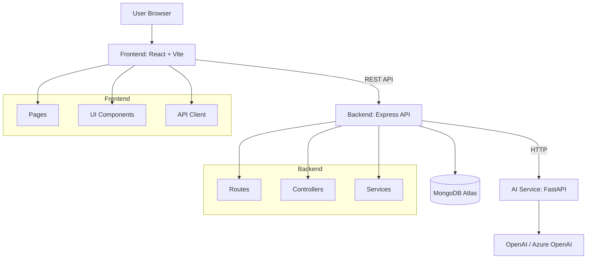

# EmpowerAI Architecture Diagram

## Notes

- Frontend talks only to backend APIs.
- Backend handles auth, persistence, and orchestrates AI calls.
- AI service handles prompt-heavy CV/twin/interview workloads.